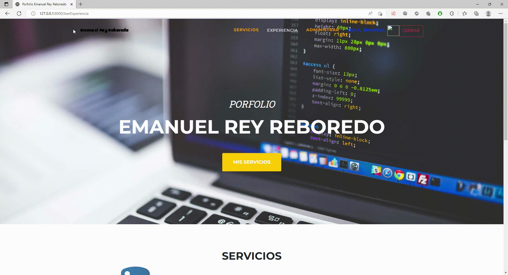

# Porfolio Emanuel Rey Reboredo

## Link de Video demostrativo de la pagina

 </img>

Proyecto de página web programado con Python y utilizando framework django

Documentos

Se descargo plantilla de bootstrap, la cual se modifica para el proyecto a presentar.

Se realiza herencias padre a hijo renderizando las vistas a la plantilla utilizada.

Archivos py:
models.py
Aquí encontramos el modelado de los datos que se utilizaron para el proyecto y base de datos

forms.py
Se crearon los formularios necesarios para poder cargar datos en nuestra base de datos desde la página web

views.py
Son las vistas creadas a partir de nuestros modelos y formularios para navegar por la web

urls.py
Ubicación de las rutas utilizadas en el proyecto

templates

En esta carpeta encontraras todos los HTML configurados para el funcionamiento y visualización de la APP. en todos se utilizo Herencia por Django y manejo de datos.

Esta pagina funciona como un curriculum virtual en el cual podes ir actualizando o cambiando datos sobre tus experiencias laborales

Autor
EmanuelReyReboredo
